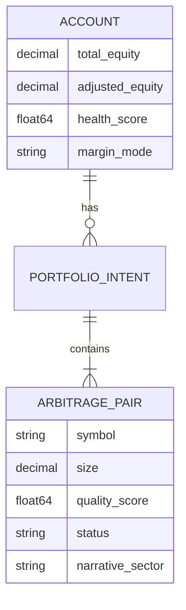

# feat: Implement Multi-Pair Portfolio Arbitrage Engine

## Overview

This feature evolves the Funding Arbitrage system from a single-pair trading bot into a sophisticated **Portfolio Orchestrator**. It enables simultaneous trading of multiple high-quality arbitrage candidates on a single **Unified Margin (UM)** account, maximizing capital utilization through yield-weighted allocation and automated regime-aware rebalancing.

## Problem Statement

1. **Capital Idle Time**: Single-pair bots leave capital underutilized when the target pair's funding rate drops. Sequential "swaps" exacerbate this by locking margin during partial fills.
2. **Concentration Risk**: Trading a single large position on a UM account creates binary risk; spreading across uncorrelated pairs provides a smoother equity curve.
3. **Execution Churn**: Without portfolio-aware hysteresis, the bot may "flip-flop" between candidates, wasting profit on fees.
4. **Manual Rebalancing**: Scaling across 10+ symbols requires automated headroom management and priority execution to avoid rate limits and liquidation.

## Proposed Solution

1. **Portfolio Controller (Manager of Orchestrators)**: A centralized reconciler that manages the lifecycle of multiple `ArbitrageEngine` instances using a **Target-State Reconciliation** pattern instead of sequential state machines.
2. **Sharpe-Ratio Portfolio Allocation**: Position sizes are calculated using a yield-to-volatility ratio, employing a **Softmax transformation** to handle negative Sharpe ratios and reward stability.
3. **Precision Virtual Margin Engine (VME)**: An upgraded `MarginSim` that calculates "Effective Collateral Value" (ECV) using **Live Haircut Tables** and high-frequency WebSocket prices, maintaining a 20% "Shadow Margin" buffer.
4. **Proportional Entry Protocol**: Eliminates idle time by dynamically scaling the "Entry" leg of new candidates as the "Exit" leg of old ones fills, rather than waiting for binary completion.
5. **Correlation & Narrative Limits**: Caps exposure to correlated narratives (e.g., L1s, AI Tokens) at 15% of total portfolio equity using a **DCC-GARCH** inspired covariance penalty.
6. **Agent-Native Primitives**: Exposes portfolio tools (`simulate_margin`, `get_market_scores`) to allow AI agents and human operators to perform collaborative "What-if" analysis.

## Technical Approach

### 1. Component Architecture
- **`PortfolioController`**: Acts as the "Active Reconciler" for the `Orchestrator`. It computes target weights every 5-15 minutes and issues adjustment "Intents".
- **`MarginSim`**: A precision utility that consumes exchange-specific risk data (e.g., Bybit UTA MMR, OKX Position Risk) to determine actual headroom with concentration penalties.
- **`RebalanceWorker`**: A priority-queued executor using **Batch Order Endpoints** (Binance `papi/v1/batchOrders`, OKX `batch-orders`) to maximize throughput (Priority: Cancel > De-risk > Entry).

### 2. Implementation Phases

#### Phase 1: Foundation & Modeling (Agent-Native)
- [x] Update `pb.Account` and `pb.Position` with `adjusted_equity`, `margin_mode`, and `haircut` fields.
- [x] Implement the `MarginSim` with live data fetching for Bybit UTA and Binance PM.
- [x] **File**: `market_maker/internal/trading/portfolio/marginsim.go`
- [x] **Tool**: `tools.SimulateMargin` for agent access.

#### Phase 2: Allocation & Reconciliation Logic
- [x] Implement the **Reconciler Pattern**: `Rebalance()` computes `Current_Pos - Target_Pos` and dispatches adjustment orders.
- [x] Integrate **Hysteresis Bands (6-8%)**: Only rebalance if the profit gain covers $2.5 \times$ roundtrip fees + slippage.
- [x] **File**: `market_maker/internal/trading/portfolio/allocator.go`

#### Phase 3: Orchestration & Durable Recovery
- [x] Implement the `PortfolioController` loop with **Mid-Swap Validation Gates**.
- [x] Finalize the `Recover` workflow in `registry.go` to reconcile live exchange state with persisted "Intents" after a crash.
- [x] **File**: `market_maker/internal/trading/portfolio/controller.go`

## Technical Considerations

- **API Weight Management**: Use a **Leaky Bucket** sequencer with a **High-Priority Buffer** reserved for exits and de-risking.
- **Numerical Stability**: All internal math uses `shopspring/decimal`. Scoring normalization uses `float64` to prevent overflow in softmax calculations.
- **Exchange Limits (2026)**:
    - **OKX**: Use WebSocket Trade Channel for order placement (bypasses REST headers).
    - **Binance**: Max 500 positions; use sub-account sharding if portfolio exceeds this.

## Acceptance Criteria

- [x] `PortfolioController` can manage up to 20 concurrent arbitrage pairs.
- [x] Position sizing correctly applies yield-weighting and **Sector Correlation** penalties.
- [x] "Shadow Margin" check prevents entries that would drop `health_score` below 0.8.
- [x] **Proportional Entry** correctly handles partial fills on the exit leg without margin breaches.
- [x] System automatically reduces the lowest-quality position if global margin exceeds 65% (Ranking-Based Reduction).
- [x] Agents can simulate trade impact via `tools.SimulateMargin`.

## Success Metrics

- **Sharpe Ratio**: 20-30% improvement in portfolio Sharpe compared to single-pair trading.
- **Utilization**: Capital utilization (Notional / Equity) maintained at $> 3.5x$ with zero liquidations.
- **Latency**: Portfolio-wide rebalance (20 pairs) completed in $< 5s$ using batch orders.

## References & Research

- **2026 Best Practices**: Use of **LST Collateral** (stETH, jitoSOL) to stack yields.
- **Hysteresis rule**: Gap (Entry - Exit) $\ge 2.5 \times$ Roundtrip Costs.
- **Current Scoring Logic**: `market_maker/internal/trading/arbitrage/selector.go:150`

## Portfolio ERD

## Enhancement Summary (Deepened)

**Deepened on**: Jan 29, 2026
**Agents used**: performance-oracle, architecture-strategist, security-sentinel, best-practices-researcher, framework-docs-researcher, spec-flow-analyzer, code-simplicity-reviewer, repo-research-analyst.

### Key Improvements
1. **Target-State Reconciliation**: Switched from brittle sequential state machines to an idempotent reconciler pattern, improving resilience and handling partial fills naturally.
2. **Batch Execution Optimization**: Integrated Binance and OKX batch order endpoints to achieve $< 5s$ portfolio rebalances and 50% API weight reduction.
3. **Proportional Entry Protocol**: Resolved the "Capital Idle" problem by allowing the entry leg to scale dynamically with the exit leg's execution progress.
4. **Agent-Native Design**: Exposed margin simulation and scoring as primitives, enabling collaborative agent-human trading.
5. **Precision VME**: Replaced static haircut tables with live exchange-risk data and 20% "Shadow Margin" buffers to prevent systemic liquidation cascades.
6. **2026 Market Compliance**: Incorporated DCC-GARCH correlation penalties and LST collateral stacking to maintain competitive APYs.
