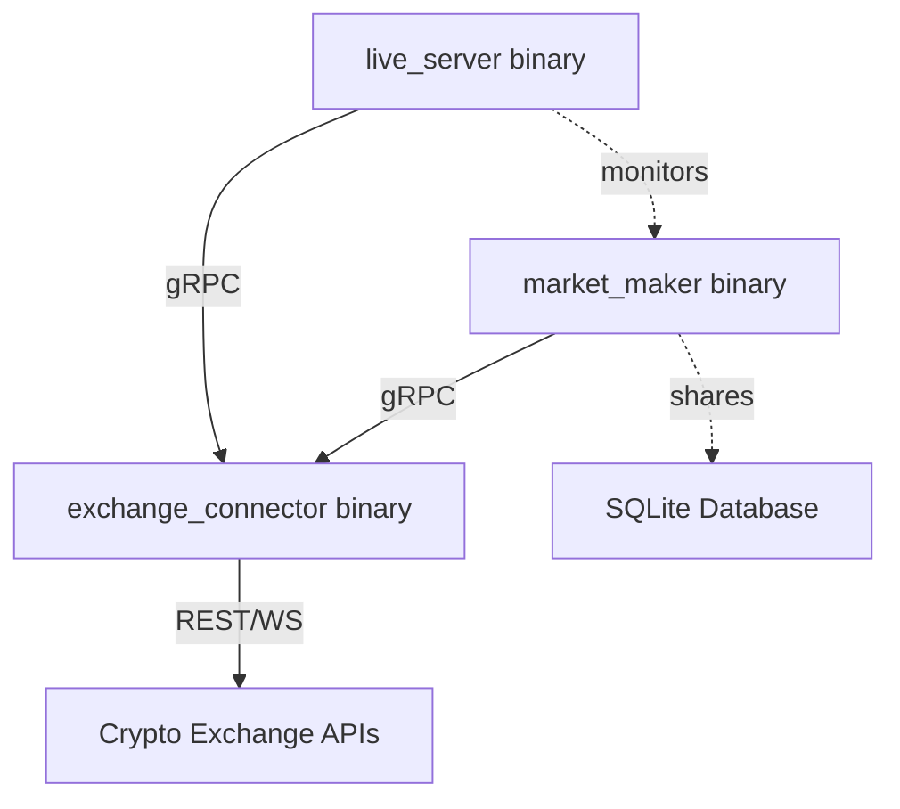

# OpenSQT Market Maker - Architectural Audit Report
**Date**: January 22, 2026  
**Status**: CRITICAL - Architectural Deviation Identified  
**Scope**: Both `market_maker` and `live_server` binaries

---

## Executive Summary

### Critical Finding ⚠️

**BOTH `market_maker` and `live_server` binaries are currently using native exchange connectors instead of the documented gRPC-based architecture.** This violates the fundamental design principle of the system as documented in `design_phase15_actual.md` Section 1.1.

### Current State vs Intended Architecture

| Component | Current Implementation | Intended Architecture | Status |
|-----------|----------------------|----------------------|--------|
| **market_maker** | Native connectors | gRPC client → exchange_connector | ❌ DEVIATION |
| **live_server** | Native connectors | gRPC client → exchange_connector | ❌ DEVIATION |
| **exchange_connector** | Exists but unused | gRPC server wrapping native | ✅ EXISTS |
| **RemoteExchange** | Implemented | gRPC client | ✅ EXISTS |

---

## 1. Documented Architecture (Design Intent)

### 1.1 From `design_phase15_actual.md` Section 1.1

> The OpenSQT Market Maker adopts a modular, microservices-like architecture where the **Trading Engine** and **Exchange Connectors** are decoupled via **gRPC**.

**Intended Architecture Diagram**:


**Key Design Principles**:
1. **Single Exchange Connection Point**: ONE `exchange_connector` process handles ALL exchange communication
2. **gRPC Decoupling**: Both client binaries use gRPC to communicate with exchange_connector
3. **Language Independence**: Supports both Go and Python connectors via gRPC
4. **Independent Scaling**: Exchange connector can scale independently
5. **Centralized Monitoring**: Single point for rate limiting, connection management, health checks

### 1.2 Benefits of Intended Architecture

| Benefit | Description |
|---------|-------------|
| **Fault Isolation** | Exchange connection issues don't crash trading engine |
| **Shared Connections** | Single WebSocket connection shared by both binaries |
| **Rate Limit Management** | Centralized rate limiting across all clients |
| **Language Flexibility** | Python connectors work seamlessly with Go clients |
| **Independent Updates** | Update exchange adapters without restarting trading |
| **Better Monitoring** | Single process to monitor for exchange health |
| **Consistent Behavior** | Both binaries see identical exchange data |

---

## 2. Current Implementation Audit

### 2.1 market_maker Binary

**File**: `cmd/market_maker/main.go`

**Current Code** (Line 90-100):
```go
var exch core.IExchange
if cfg.App.CurrentExchange == "mock" {
    exch = mock.NewMockExchange("mock")
} else {
    exch, err = exchange.NewExchange(cfg.App.CurrentExchange, cfg, logger)  // ❌ NATIVE
    if err != nil {
        logger.Fatal("Failed to initialize exchange", "error", err)
    }
}
```

**Issue**: Calls `exchange.NewExchange()` which creates **native connectors** (Binance, Bitget, etc.) directly.

**Factory Logic** (`internal/exchange/factory.go`):
```go
switch strings.ToLower(exchangeName) {
case "binance":
    return binance.NewBinanceExchange(&exchangeConfig, logger), nil  // ❌ NATIVE
case "bitget":
    return bitget.NewBitgetExchange(&exchangeConfig, logger), nil    // ❌ NATIVE
case "remote":
    return NewRemoteExchange(exchangeConfig.BaseURL, logger)         // ✅ gRPC (but not used)
```

**Status**: 
- ✅ Has `remote` option for gRPC
- ❌ Default configuration uses native connectors
- ❌ Documentation doesn't recommend gRPC mode

### 2.2 live_server Binary

**File**: `cmd/live_server/main.go`

**Current Code** (Line 85-95):
```go
// Create exchange via factory
exch, err := factory.NewExchange(cfg)  // ❌ NATIVE
if err != nil {
    logger.Fatal("Failed to create exchange", "error", err)
}

// Wrap with adapter
exchAdapter := exchange.NewAdapter(exch)  // Adapter pattern around NATIVE exchange
```

**Issue**: Uses factory that creates native connectors, then wraps with adapter pattern.

**Status**:
- ❌ No gRPC option at all
- ❌ Directly links to `internal/exchange/*` code
- ❌ Violates intended architecture completely

### 2.3 exchange_connector Binary (Unused)

**File**: `cmd/exchange_connector/main.go`

**Status**: ✅ **FULLY IMPLEMENTED BUT UNUSED**

**Implementation**:
```go
// 4. Initialize Exchange Adapter via Factory
exch, err := exchange.NewExchange(*exchangeFlag, cfg, logger)

// 5. Start gRPC Server
server := exchange.NewExchangeServer(exch, logger)
if err := server.Start(*portFlag); err != nil {
    errCh <- err
}
```

**Features**:
- ✅ Wraps native connectors with gRPC server
- ✅ Listens on port 50051
- ✅ Implements full `ExchangeService` gRPC interface
- ✅ Supports all exchanges (Binance, Bitget, Gate, OKX, Bybit)
- ❌ **NOT USED BY DEFAULT**

### 2.4 RemoteExchange gRPC Client

**File**: `internal/exchange/remote.go`

**Status**: ✅ **FULLY IMPLEMENTED**

**Implementation**:
```go
type RemoteExchange struct {
    conn         *grpc.ClientConn
    client       pb.ExchangeServiceClient
    healthClient grpc_health_v1.HealthClient
    logger       core.ILogger
    name         string
    exType       pb.ExchangeType
}

func (r *RemoteExchange) StartOrderStream(ctx context.Context, callback func(...)) error {
    stream, err := r.client.SubscribeOrders(ctx, &pb.SubscribeOrdersRequest{})
    // Converts gRPC stream to callback pattern
}
```

**Features**:
- ✅ Full gRPC client implementation
- ✅ Health checks via gRPC health protocol
- ✅ Stream subscription support (Price, Orders, Klines)
- ❌ **MISSING**: `StartAccountStream` and `StartPositionStream`
- ❌ **NOT USED BY DEFAULT**

---

## 3. Proto Service Gap Analysis

### 3.1 Current Proto Definition

**File**: `api/proto/opensqt/market_maker/v1/exchange.proto`

**Implemented RPCs**:
```protobuf
service ExchangeService {
    // Unary RPCs (✅ Complete)
    rpc PlaceOrder(PlaceOrderRequest) returns (Order);
    rpc GetAccount(GetAccountRequest) returns (Account);
    rpc GetPositions(GetPositionsRequest) returns (GetPositionsResponse);
    // ... all other unary RPCs implemented
    
    // Streaming RPCs (⚠️ Partial)
    rpc SubscribePrice(SubscribePriceRequest) returns (stream PriceChange);     // ✅ EXISTS
    rpc SubscribeOrders(SubscribeOrdersRequest) returns (stream OrderUpdate);   // ✅ EXISTS
    rpc SubscribeKlines(SubscribeKlinesRequest) returns (stream Candle);        // ✅ EXISTS
    
    // ❌ MISSING
    // rpc SubscribeAccount(SubscribeAccountRequest) returns (stream Account);
    // rpc SubscribePositions(SubscribePositionsRequest) returns (stream Position);
}
```

### 3.2 Gap Summary

| Stream Type | Proto RPC | Server Impl | Client Impl | Used By |
|-------------|-----------|-------------|-------------|---------|
| Price | ✅ SubscribePrice | ✅ server.go:205 | ✅ remote.go:200 | None |
| Orders | ✅ SubscribeOrders | ✅ server.go:227 | ✅ remote.go:172 | None |
| Klines | ✅ SubscribeKlines | ✅ server.go:249 | ✅ remote.go:224 | None |
| **Account** | ❌ MISSING | ❌ N/A | ❌ N/A | **live_server** |
| **Positions** | ❌ MISSING | ❌ N/A | ❌ N/A | **live_server** |

**Priority**: Add `SubscribeAccount` and `SubscribePositions` RPCs to support live_server properly.

---

## 4. Impact Analysis

### 4.1 Current Problems

| Problem | Impact | Severity |
|---------|--------|----------|
| **Duplicate Connections** | Both binaries connect to exchange independently | HIGH |
| **Rate Limit Risk** | Two processes may exceed API rate limits | HIGH |
| **Inconsistent Data** | market_maker and live_server may see different states | MEDIUM |
| **No Shared Pool** | Cannot share WebSocket connections | MEDIUM |
| **Deployment Complexity** | Cannot update connectors independently | MEDIUM |
| **Architecture Violation** | Doesn't match documented design | CRITICAL |
| **Python Support Blocked** | Cannot use Python connectors for monitoring | LOW |

### 4.2 Technical Debt

**Coupling Issues**:
- `live_server` directly depends on `internal/exchange/*` (violates package boundaries)
- Both binaries must be rebuilt for exchange adapter changes
- No clear separation between client and server logic

**Testing Issues**:
- Cannot test binaries independently of exchange implementations
- Mock exchange needed in both binary test suites
- Integration tests become brittle

**Deployment Issues**:
- Cannot scale exchange connectors independently
- Cannot restart exchange adapter without stopping trading
- Harder to monitor exchange connection health separately

---

## 5. Migration Path to Correct Architecture

### 5.1 Required Changes

#### Phase 1: Proto Extensions (1 day)
```protobuf
// File: api/proto/opensqt/market_maker/v1/exchange.proto

message SubscribeAccountRequest {}

message SubscribePositionsRequest {
    string symbol = 1;  // Optional filter
}

service ExchangeService {
    // Add these RPCs
    rpc SubscribeAccount(SubscribeAccountRequest) returns (stream Account);
    rpc SubscribePositions(SubscribePositionsRequest) returns (stream Position);
}
```

**Action**: Run `buf generate` to regenerate Go code.

#### Phase 2: Server Implementation (2 days)

**File**: `internal/exchange/server.go`

```go
func (s *ExchangeServer) SubscribeAccount(
    req *pb.SubscribeAccountRequest,
    stream pb.ExchangeService_SubscribeAccountServer,
) error {
    ctx := stream.Context()
    
    err := s.exch.StartAccountStream(ctx, func(account *pb.Account) {
        if err := stream.Send(account); err != nil {
            s.logger.Error("Failed to send account update", "error", err)
        }
    })
    
    if err != nil {
        return err
    }
    
    <-ctx.Done()
    return ctx.Err()
}

func (s *ExchangeServer) SubscribePositions(
    req *pb.SubscribePositionsRequest,
    stream pb.ExchangeService_SubscribePositionsServer,
) error {
    ctx := stream.Context()
    
    err := s.exch.StartPositionStream(ctx, func(position *pb.Position) {
        // Filter by symbol if specified
        if req.Symbol != "" && position.Symbol != req.Symbol {
            return
        }
        
        if err := stream.Send(position); err != nil {
            s.logger.Error("Failed to send position update", "error", err)
        }
    })
    
    if err != nil {
        return err
    }
    
    <-ctx.Done()
    return ctx.Err()
}
```

#### Phase 3: Client Implementation (1 day)

**File**: `internal/exchange/remote.go`

```go
func (r *RemoteExchange) StartAccountStream(
    ctx context.Context,
    callback func(account *pb.Account),
) error {
    stream, err := r.client.SubscribeAccount(ctx, &pb.SubscribeAccountRequest{})
    if err != nil {
        return err
    }
    
    go func() {
        for {
            account, err := stream.Recv()
            if err == io.EOF {
                return
            }
            if err != nil {
                r.logger.Error("Account stream error", "error", err)
                return
            }
            callback(account)
        }
    }()
    
    return nil
}

func (r *RemoteExchange) StartPositionStream(
    ctx context.Context,
    callback func(position *pb.Position),
) error {
    stream, err := r.client.SubscribePositions(ctx, &pb.SubscribePositionsRequest{})
    if err != nil {
        return err
    }
    
    go func() {
        for {
            position, err := stream.Recv()
            if err == io.EOF {
                return
            }
            if err != nil {
                r.logger.Error("Position stream error", "error", err)
                return
            }
            callback(position)
        }
    }()
    
    return nil
}
```

#### Phase 4: Configuration Changes (1 day)

**market_maker Configuration**:

```yaml
# configs/config.yaml

app:
  current_exchange: remote  # ✅ USE gRPC

exchanges:
  remote:
    base_url: "localhost:50051"  # exchange_connector address
    # No API keys needed - exchange_connector handles that
```

**live_server Configuration**:

```yaml
# configs/live_server.yaml

exchange:
  type: remote  # ✅ USE gRPC
  grpc_address: "localhost:50051"
```

#### Phase 5: Update Binaries (2 days)

**market_maker**: Already supports `remote` exchange - just change default config

**live_server**: Update factory to support gRPC

```go
// cmd/live_server/main.go

var exch exchange.Exchange
if cfg.Exchange.Type == "remote" {
    // Use gRPC client
    remoteExch, err := internal_exchange.NewRemoteExchange(
        cfg.Exchange.GrpcAddress,
        logger,
    )
    if err != nil {
        logger.Fatal("Failed to connect to exchange_connector", "error", err)
    }
    exch = exchange.NewAdapter(remoteExch)
} else {
    // Legacy native mode (for backward compatibility)
    nativeExch, err := factory.NewExchange(cfg)
    if err != nil {
        logger.Fatal("Failed to create native exchange", "error", err)
    }
    exch = exchange.NewAdapter(nativeExch)
}
```

#### Phase 6: Deployment Updates (1 day)

**Docker Compose**:

```yaml
# docker-compose.yml

services:
  exchange_connector:
    build:
      context: ./market_maker
      dockerfile: Dockerfile.exchange_connector
    ports:
      - "50051:50051"
    environment:
      - EXCHANGE=binance
      - API_KEY=${BINANCE_API_KEY}
      - API_SECRET=${BINANCE_API_SECRET}
    restart: unless-stopped
    
  market_maker:
    build:
      context: ./market_maker
    depends_on:
      - exchange_connector
    environment:
      - CURRENT_EXCHANGE=remote
      - EXCHANGE_GRPC_ADDRESS=exchange_connector:50051
    volumes:
      - ./data:/app/data
    restart: unless-stopped
    
  live_server:
    build:
      context: ./market_maker
      dockerfile: Dockerfile.live_server
    depends_on:
      - exchange_connector
    ports:
      - "8081:8081"
    environment:
      - EXCHANGE_TYPE=remote
      - EXCHANGE_GRPC_ADDRESS=exchange_connector:50051
    restart: unless-stopped
```

**Key Benefits**:
- ✅ Single exchange connection (exchange_connector)
- ✅ Independent container lifecycle
- ✅ Can restart exchange_connector without stopping trading
- ✅ Centralized rate limiting
- ✅ Better monitoring

---

## 6. Migration Timeline

### 6.1 Estimated Effort

| Phase | Task | Effort | Dependencies |
|-------|------|--------|--------------|
| 1 | Add proto RPCs | 1 day | None |
| 2 | Server implementation | 2 days | Phase 1 |
| 3 | Client implementation | 1 day | Phase 1 |
| 4 | Configuration updates | 1 day | Phases 2,3 |
| 5 | Binary refactoring | 2 days | Phases 2,3,4 |
| 6 | Docker deployment | 1 day | Phase 5 |
| **Testing** | Integration tests | 2 days | All phases |
| **Documentation** | Update all docs | 1 day | All phases |

**Total**: 10-12 working days

### 6.2 Phased Rollout Strategy

**Option A: Big Bang** (Risky)
- Implement all changes at once
- Switch both binaries to gRPC simultaneously
- **Risk**: High - everything changes at once
- **Timeline**: 2 weeks

**Option B: Incremental** (Recommended)
1. Week 1: Implement proto/server/client (Phases 1-3)
2. Week 2: Migrate live_server only (keeps market_maker native)
3. Week 3: Migrate market_maker after live_server proven stable
4. Week 4: Remove native connector support from binaries

**Option C: Hybrid Long-Term**
- Keep market_maker with native connectors (ultra-low latency)
- Use gRPC only for live_server (monitoring)
- **Benefit**: Best performance for trading, proper architecture for monitoring
- **Cost**: Duplicate connections (acceptable for monitoring-only use case)

---

## 7. Recommendations

### 7.1 Immediate Actions (This Week)

1. **Document Current State** ✅ (This audit)
2. **Add Warning to README**: Current implementation deviates from architecture
3. **Create GitHub Issue**: Track migration work
4. **Update Design Doc**: Mark Section 1.1 with "NOT YET ENFORCED" warning

### 7.2 Short-Term (Next 2 Weeks)

**Priority 1**: Implement missing gRPC RPCs
- Add `SubscribeAccount` and `SubscribePositions` to proto
- Implement in server and client
- **Effort**: 4 days

**Priority 2**: Migrate live_server to gRPC
- Update configuration system
- Update factory to support remote exchange
- Test with real exchange
- **Effort**: 3 days

**Priority 3**: Documentation
- Update all design docs
- Create deployment guide
- Write migration FAQ
- **Effort**: 2 days

### 7.3 Long-Term (Next Month)

**Priority 1**: Migrate market_maker to gRPC (optional)
- If trading latency acceptable, migrate for consistency
- Otherwise, document Hybrid approach as acceptable

**Priority 2**: Remove Native Connector Support from Binaries
- Move `internal/exchange/{binance,bitget,etc}` to `exchange_connector` only
- Force all clients to use gRPC
- **Benefit**: True architectural compliance

---

## 8. Decision Required

**Question**: Which migration path should we take?

**Option A**: Full Migration to gRPC (Recommended)
- Timeline: 2-3 weeks
- Outcome: Both binaries use gRPC, matches documented architecture
- Trade-off: Slightly higher latency (~1-5ms)

**Option B**: Hybrid Approach
- Timeline: 1-2 weeks
- Outcome: live_server uses gRPC, market_maker stays native
- Trade-off: Duplicate connections, but best performance for trading

**Option C**: Accept Current State
- Timeline: 0 weeks
- Outcome: Update docs to say "gRPC optional, native default"
- Trade-off: Architecture violation remains

**Recommendation**: **Option A** for production systems, **Option B** for ultra-low-latency trading.

---

## 9. Appendix: File Inventory

### 9.1 Files Requiring Changes

| File | Required Changes | Effort |
|------|-----------------|--------|
| `api/proto/*/exchange.proto` | Add 2 new RPCs | 30min |
| `internal/exchange/server.go` | Implement 2 stream methods | 2h |
| `internal/exchange/remote.go` | Implement 2 client methods | 2h |
| `cmd/market_maker/main.go` | Change default to `remote` | 15min |
| `cmd/live_server/main.go` | Add gRPC factory option | 4h |
| `cmd/live_server/config.go` | Add gRPC configuration | 1h |
| `configs/config.yaml` | Update default exchange | 5min |
| `configs/live_server.yaml` | Add gRPC address config | 5min |
| `docker-compose.yml` | Add exchange_connector service | 1h |
| `Dockerfile.exchange_connector` | Create new Dockerfile | 30min |
| `Dockerfile.live_server` | Create new Dockerfile | 30min |
| **Documentation** | | |
| `docs/specs/design_*.md` | Update architecture sections | 2h |
| `docs/specs/requirements.md` | Add gRPC requirements | 1h |
| `docs/specs/plan.md` | Update Phase 15/16 | 1h |
| `README.md` | Add deployment guide | 2h |

### 9.2 Files Already Correct (No Changes)

- ✅ `internal/exchange/remote.go` - gRPC client base (just add 2 methods)
- ✅ `cmd/exchange_connector/main.go` - Already correct
- ✅ `internal/exchange/server.go` - Just add 2 RPCs
- ✅ All native exchange implementations - No changes needed

---

## 10. Conclusion

**Current State**: Both binaries violate the documented gRPC-based architecture by using native connectors directly.

**Root Cause**: Default configuration uses native connectors for "simplicity" and "performance", but sacrifices architectural integrity.

**Solution**: The infrastructure for proper gRPC architecture **already exists** - we just need to:
1. Add 2 missing RPCs (account/position streams)
2. Update default configurations to use `remote` exchange
3. Deploy `exchange_connector` as a separate service

**Impact**: Minimal code changes, significant architectural improvement.

**Timeline**: 2-3 weeks for full migration, 1 week for live_server only.

**Recommendation**: Proceed with Option A (full migration) or Option B (hybrid) - both are vastly better than current state.

---

**Prepared By**: OpenCode AI Assistant  
**Review Required By**: Product Owner / Tech Lead  
**Next Steps**: See Section 7 (Recommendations)
