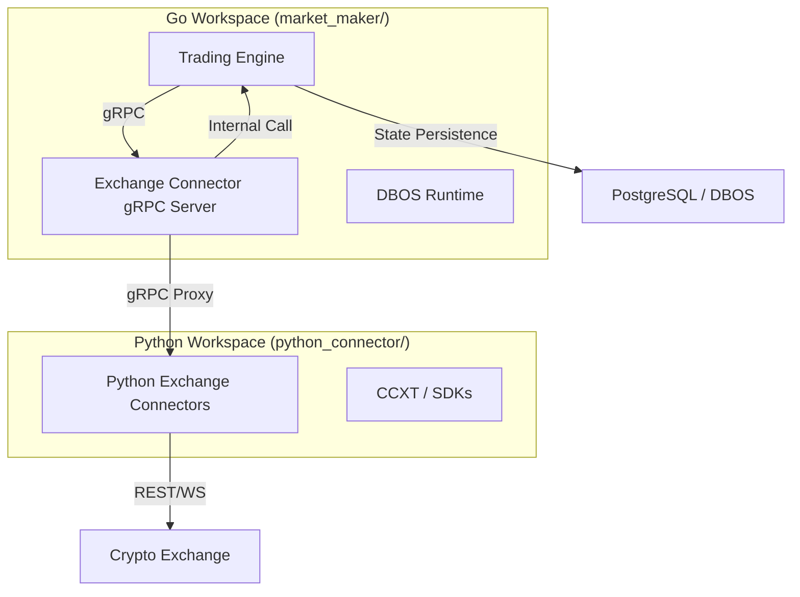
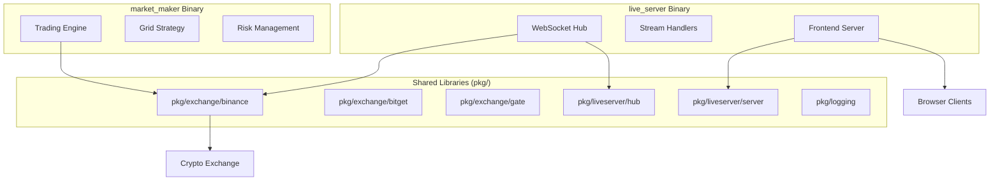

# System Design & Architecture

## 1. Architectural Overview

The OpenSQT Market Maker adopts a modular, polyglot architecture where the **Trading Engine** and **Exchange Connectors** are decoupled via **gRPC**.



### 1.1 Multi-Language Workspace
The repository is a hybrid workspace:
- **Root**: Contains orchestration configs (`docker-compose.yml`, `pyproject.toml`) and documentation.
- **`market_maker/`**: The core Go project for the high-performance engine (Active Go Workspace).
- **`python_connector/`**: A Python-based gRPC service providing additional exchange connectivity (Active Python Workspace).
- **`archive/legacy/`**: Archived monolithic Go code for reference (Excluded from active workspace).

### 1.2 Native vs Remote Connectors
The system is designed for a **Native-First** approach:
- **Native Path**: Go-native adapters (Binance, Bitget, Gate, OKX, Bybit) are linked directly into the `market_maker` binary. This path eliminates gRPC overhead and provides the lowest possible latency.
- **Remote Path**: For exchanges without a Go adapter, the engine connects to a remote gRPC sidecar (e.g., the Python Connector). This is enabled by setting `current_exchange: remote` in the config.

### 1.3 Connector & Model Audit Patterns
To maintain polyglot consistency, the system follows these audit patterns:
- **Protocol Parity**: Periodic automated comparison of Go and Python Protobuf generated code to ensure field alignment.
- **Workflow Verification**: Verification that side-effect heavy workflows (Order Placement/Cancellation) behave identically across all connectors.
- **Data Model Normalization**: Rigorous mapping from exchange-specific JSON responses to internal `decimal` and `datetime` representations.

### 1.4 Data Model → Workflow → Persistence Map
- Protos (`types`, `resources`, `events`, `state`) define canonical shapes for Orders, Positions, State, and Events.
- Simple engine persists `State` (slots, last_price) via SQLite WAL (`internal/engine/simple/store_sqlite.go`).
- Durable engine wraps trading side effects in DBOS workflows (`internal/engine/durable/workflow.go`) to guarantee exactly-once execution on replay.
- E2E tests validate these flows end-to-end (crash recovery, risk triggers, DBOS replay, gRPC stack).

### 1.5 Grid Trading Workflow (overview)
- Inputs: prices + risk signals → `GridStrategy` computes desired order actions.
- State holder: `SuperPositionManager` tracks slots, order/client maps, and idempotency keys; restores from `pb.State` after crash.
- Execution: `OrderExecutor` applies rate limits/retries and calls `IExchange` (or Adapter) using `client_order_id` for idempotency.
- Durable path: `TradingWorkflows.OnPriceUpdate` (DBOS) runs steps: CalculateAdjustments → Execute (place/cancel) → ApplyResults.
- Validation: offline E2E (simulated exchange + SQLite) must assert crash recovery, risk-trigger cancel, and slot integrity; integration E2E assert gRPC stack and connector parity.
- Progress: grid idempotency, risk-trigger cancel, and restore-routing now covered by unit tests (see `docs/specs/grid_workflow_audit_spec.md`).

### 1.6 Funding & Arbitrage Workflow (overview)
- Model: `FundingRate` / `FundingUpdate` use ms timestamps; `predicted_rate` optional; spot returns 0 funding with `next_funding_time=0`.
- Signal: Arbitrage decisions must consume funding **spread** (short – long) and real interval to compute APR; both legs’ funding streams are required.
- Pipeline: Exchange connectors → gRPC ExchangeServer (implements funding RPC/streams) → FundingMonitor (configured symbols, no hardcoding) → spread snapshot → ArbitrageEngine/DBOSArbitrageEngine.
- Execution: Workflows must be idempotent (deterministic `client_order_id`), single in-flight per symbol, and size legs/compensation from executed quantities; margin-capable spot legs must set `use_margin` and surface stable errors on borrow failures.
- Risk & Metrics: Funding staleness/lag, spread/APR, exposure, margin/liquidation distance, retries/slippage metrics; circuit-breakers pause entry or force exit on unsafe signals.

### 1.6.1 Spot–Perp Funding Strategy (directionality)
- Positive funding (perp pays): long spot and short perp to collect funding. For shorting spot, set `use_margin=true` on the spot leg and ensure borrow limits allow the size.
- Negative funding (perp receives): borrow/short spot and long perp to collect funding (respect venue borrow/position limits and risk gates); spot shorting must set `use_margin=true`.
- Spread/APR uses both legs; entry blocked if either leg data missing or feed is stale.
- Error handling: margin-disabled / borrow-limit / insufficient collateral must map to deterministic errors that block re-entry until conditions change; duplicate `client_order_id` must return idempotent success.

### 1.7 Metrics Monitor (funding/grid/arb)
- Data quality: feed staleness seconds and stream lag ms for price/order/funding/position feeds; reconnect counters per stream.
- Funding: gauges for current/predicted funding, spread, and spread APR per (long_exchange, short_exchange, symbol) with bounded label sets.
- Risk: exposure (spot/perp/net), margin ratio, liquidation distance per exchange/symbol; state gauge for arb entry/exit.
- Execution: retries/failures (small reason enum), hedge slippage histogram, rate-limit wait (optional) with low-cardinality labels.
- Circuit-break actions: stale feeds, high retries, unsafe margin/liquidation distance trigger breakers to pause entry/quote and/or force exit per strategy policy.
- Funding monitor behavior: symbols are provided by config (no hardcoding), staleness (TTL) is exposed per exchange/symbol and must gate arb entry when stale.

### 1.8 TDD Plan (funding/arb)
- RED: unit tests for funding mapping (per venue), ms timestamps, spot sentinel, predicted_rate optional.
- RED: spread/APR calculator uses both legs and real interval; no decision if either leg missing.
- RED: FundingMonitor staleness TTL and Subscribe(exchange,symbol) filtering.
- RED: workflow idempotency (deterministic client_order_id) and single in-flight guard; partial-fill sizing of opposite leg/unwind.
- RED: margin flag propagation (`use_margin`) for spot legs; margin rejection handling and error mapping; borrow-limit guardrails.
- GREEN/REFACTOR: implement then refactor with metrics and circuit-breakers enabled.

### 1.6.2 Margin Flag Propagation (design detail)
- Protocol: `PlaceOrderRequest.use_margin` (bool, default false) controls spot margin routing; must be ignored for perp legs.
- Engine: Arbitrage planner sets `use_margin=true` for spot short (or borrow-requiring) legs; planner must fail fast if venue/config marks margin unsupported.
- Connector (Go Binance Spot): translate `use_margin` into margin endpoint/params, reuse `client_order_id`, and preserve idempotent handling for duplicate IDs; map margin-specific errors to `apperrors`.
- Connector (Python): mirror the above semantics and mapping for parity; share error code map in `python_connector/src/connector/errors.py`.
- Tests: unit tests on planners (flag set), connector margin path, and offline E2E to ensure spread decision leads to correct margin behavior and stable error mapping.
- Backward compatibility: `use_margin` is optional and defaults false; existing non-margin flows remain unchanged.
- Replay/resume: DBOS/simple engines must persist and replay `use_margin` as part of workflow/order DTOs so retries do not lose margin routing.

Update: Compensation paths now preserve `use_margin` to avoid dropping margin routing during rollback/cleanup. Python gate pending: regenerate protos and align tests to `resources_pb2`/`types_pb2`, add pytest-asyncio config (REQ-ARB-019/020/021).

### 1.6.3 Phase 28 Test Plan (TDD)
- Proto RED: assert `use_margin` field exists and serializes/deserializes in Go/Python stubs.
- Engine RED: planner sets `use_margin` on spot short legs; missing flag causes rejection; flag present proceeds.
- Connector RED (Go/Python): margin path selects correct endpoint/params, preserves `client_order_id`, and maps duplicate/borrow-limit errors deterministically.
- E2E RED (offline): positive/negative funding scenarios validate margin routing, rejection handling, and no duplicate orders.
- GREEN: implement to satisfy RED; audit/tests must pass before refactor.

### 1.6.4 Margin Error Mapping (design detail)
- Map to shared `apperrors` categories:
  - margin disabled → `ErrMarginUnavailable` (retry-safe when config/venue changes)
  - borrow cap exceeded / insufficient collateral → `ErrInsufficientCollateral`
  - duplicate `client_order_id` → idempotent success / `ErrAlreadyExists`
  - generic margin rejection → `ErrUpstreamRejected`
- Go/Python connectors share the same mapping table; tests assert parity and determinism.
- Progress: spread calculator (`ComputeSpread`, `AnnualizeSpread`) implemented with unit tests.

### 1.5 Grid Trading Workflow (overview)
- Inputs: prices + risk signals → `GridStrategy` computes desired order actions.
- State holder: `SuperPositionManager` tracks slots, order/client maps, and idempotency keys; restores from `pb.State` after crash.
- Execution: `OrderExecutor` applies rate limits/retries and calls `IExchange` (or Adapter) using `client_order_id` for idempotency.
- Durable path: `TradingWorkflows.OnPriceUpdate` (DBOS) runs steps: CalculateAdjustments → Execute (place/cancel) → ApplyResults.
- Validation: offline E2E (simulated exchange + SQLite) must assert crash recovery, risk-trigger cancel, and slot integrity; integration E2E assert gRPC stack and connector parity.

### 7.5 Test Suite Structure (Grid focus)
- Offline (must run): unit/race suites (`./internal`, `./pkg`) and targeted E2E (`CrashRecovery`, `RiskProtection`, `TradingFlow`).
- Integration (env/tag): full `./tests/e2e` matrix (startup, loopback, health, DBOS, arbitrage) when deps are available.
- TDD: add RED tests for grid invariants (idempotent client_order_id, risk-trigger cancel, restore routing), then GREEN implementations, then refactor.
- Progress: grid idempotency, risk-trigger cancel, and restore-routing now covered by unit tests (see `docs/specs/grid_workflow_audit_spec.md`).

## 2. Exchange Connector

### 2.1 Responsibilities
- **Protocol Translation**: Map gRPC/Internal requests to REST/WebSocket API calls.
- **Normalization**: Standardize order status, sides, and error codes.
- **Resilience**: Handle WebSocket reconnections and API rate limiting.

### 2.2 Interface Design
- **Schema**: Defined in `api/proto/opensqt/market_maker/v1/`.
- **Standardization**: Managed via the **Buf CLI**.
  - Protobuf field names MUST be `snake_case` (e.g., `order_id`, `client_order_id`).
  - Generated Go fields are produced by `protoc-gen-go` and will typically be `OrderId` / `ClientOrderId`.
  - Hand-written Go code MUST use idiomatic acronyms for locals and parameters (e.g., `orderID`, `clientOrderID`) to satisfy `staticcheck` (ST1003) without editing generated code.

## 3. Trading Engine (Core)

### 3.1 Durable Workflows
The core logic relies on a durable execution model to ensure reliability and crash recovery.
- **Simple Implementation**: The `SimpleEngine` persists state transitions to a SQLite database (`Store`) *before* acknowledging completion.
- **DBOS Implementation**: The `DBOSEngine` leverages the DBOS runtime to provide true durable workflows. All exchange side-effects (Place/Cancel Order) MUST be executed within `ctx.RunWorkflow` or as atomic steps via `ctx.RunAsStep` to ensure exactly-once execution and survivability across process restarts.
- **Guarantee**: On crash, the system reloads the grid and reconciles with the exchange via `RestoreFromExchangePosition`.

### 3.2 Modular Strategy Execution
The strategy layer is completely decoupled from the engine:
- **`IStrategy`**: A pure logic interface.
- **`GridStrategy`**: Implementation of a high-frequency grid trading logic with `Long` and `Neutral` (Market Making) modes.

### 3.3 Health Monitoring
The system uses a centralized `HealthManager` to aggregate status from all modules.
- **Components**: Each critical module (PriceMonitor, RiskMonitor, etc.) registers a health check function.
- **Aggregation**: The manager periodically executes checks and determines global health.
- **gRPC Sidecars**: The engine uses the standard gRPC Health Checking Protocol to monitor the availability of remote connectors.
- **Endpoints**:
    - `GET /health`: Liveness probe for orchestrators (e.g., Docker/K8s).
    - `GET /status`: Detailed diagnostic data in JSON format.

## 4. Production Deployment

### 4.1 Containerization
The entire stack is containerized for consistent deployment across environments.
- **Market Maker (Go)**: A high-performance, minimal image based on Distroless.
- **Python sidecar (Optional)**: Only deployed if using Python-specific connectors.

### 4.2 Local Orchestration (Docker Compose)
Standard deployment uses Docker Compose to manage the engine, persistent volumes, and optional sidecars.

```yaml
services:
  market-maker:
    image: opensqt/market-maker:latest
    volumes:
      - ./data:/app/data
      - ./configs:/app/configs
    environment:
      - EXCHANGE=binance
```

### 4.3 Persistence
All critical state (inventory, active orders) is stored in a SQLite database located in a persistent volume. This allows the bot to be upgraded or restarted without losing track of current positions.

## 5. End-to-End Validation Architecture
E2E tests utilize the `SimulatedExchange` and a dedicated test engine instance.
- **Scenario Injection**: Tests inject specific sequences of prices and volumes.
- **State Inspection**: After each event, the test suite verifies both the in-memory `PositionManager` and the SQLite `Store`.
- **Concurrency Test**: Simulate rapid fire updates to ensure mutexes and atomic operations prevent race conditions.

## 6. Live Monitoring & Visualization Architecture (Phase 15 - Standalone Binary)

### 6.1 Overview
A **standalone live_server binary** built on proven market_maker components. This architecture provides complete isolation between trading and monitoring while maximizing code reuse.

### 6.2 Architecture Diagram


### 6.3 Component Design

#### 6.3.1 Shared Library Structure

**pkg/exchange/** (Reusable Exchange Connectors)
```
pkg/exchange/
├── interface.go        # IExchange interface
├── factory.go          # Exchange creation factory
├── binance/
│   ├── binance.go
│   ├── websocket.go
│   └── binance_test.go
├── bitget/
├── gate/
├── okx/
└── bybit/
```

**Key Interface**:
```go
package exchange

type IExchange interface {
    // Identity
    GetName() string
    CheckHealth(ctx context.Context) error
    
    // Streams
    StartKlineStream(ctx context.Context, symbols []string, interval string, callback func(*pb.Candle)) error
    StartOrderStream(ctx context.Context, callback func(*pb.OrderUpdate)) error
    
    // REST
    GetHistoricalKlines(ctx context.Context, symbol string, interval string, limit int) ([]*pb.Candle, error)
    GetOpenOrders(ctx context.Context, symbol string) ([]*pb.Order, error)
    GetAccount(ctx context.Context) (*pb.Account, error)
    GetPositions(ctx context.Context, symbol string) ([]*pb.Position, error)
}
```

**pkg/liveserver/** (WebSocket Hub Pattern)
```
pkg/liveserver/
├── hub.go              # Broadcast hub
├── hub_test.go
├── messages.go         # Message type definitions
├── messages_test.go
├── server.go           # HTTP + WebSocket server
├── server_test.go
├── client.go           # Client wrapper
└── auth.go             # Optional authentication
```

**Hub Interface**:
```go
package liveserver

type Hub interface {
    Run(ctx context.Context)
    Register(client *Client)
    Unregister(client *Client)
    Broadcast(msg Message)
    ClientCount() int
}

type Message struct {
    Type string      `json:"type"`
    Data interface{} `json:"data"`
}
```

#### 6.3.2 live_server Binary Structure
```
cmd/live_server/
├── main.go             # Entry point
├── streams.go          # Exchange stream handlers
├── config.go           # Configuration loading
└── handlers.go         # HTTP handlers
```

**main.go Structure**:
```go
package main

func main() {
    // 1. Parse flags
    configFile := flag.String("config", "configs/live_server.yaml", "Config file")
    port := flag.String("port", ":8081", "Server port")
    
    // 2. Initialize logger
    logger := logging.NewZapLogger("INFO")
    
    // 3. Load configuration
    cfg := loadConfig(*configFile)
    
    // 4. Create exchange (read-only)
    exch, err := exchange.NewExchange(cfg.Exchange.Name, cfg, logger)
    
    // 5. Create WebSocket hub
    hub := liveserver.NewHub(logger)
    go hub.Run(context.Background())
    
    // 6. Start exchange stream handlers
    go streamKlines(exch, hub, cfg)
    go streamOrders(exch, hub)
    go streamAccount(exch, hub)
    
    // 7. Start HTTP/WebSocket server
    server := liveserver.NewServer(hub, logger)
    server.Start(*port)
}
```

**Stream Handlers**:
```go
// streams.go
func streamKlines(exch exchange.IExchange, hub liveserver.Hub, cfg *Config) {
    ctx := context.Background()
    
    exch.StartKlineStream(ctx, []string{cfg.Symbol}, "1m", func(candle *pb.Candle) {
        hub.Broadcast(liveserver.Message{
            Type: "kline",
            Data: map[string]interface{}{
                "time":   candle.OpenTime / 1000,
                "open":   candle.Open,
                "high":   candle.High,
                "low":    candle.Low,
                "close":  candle.Close,
                "volume": candle.Volume,
            },
        })
    })
}

func streamOrders(exch exchange.IExchange, hub liveserver.Hub) {
    ctx := context.Background()
    
    exch.StartOrderStream(ctx, func(update *pb.OrderUpdate) {
        hub.Broadcast(liveserver.Message{
            Type: "orders",
            Data: map[string]interface{}{
                "id":     update.OrderId,
                "price":  update.Price,
                "side":   update.Side,
                "status": update.Status,
                "symbol": update.Symbol,
            },
        })
        
        // Trade event on fill
        if update.Status == "FILLED" {
            hub.Broadcast(liveserver.Message{
                Type: "trade_event",
                Data: map[string]interface{}{
                    "side":   strings.ToLower(update.Side),
                    "price":  update.Price,
                    "amount": update.Quantity,
                    "symbol": update.Symbol,
                    "time":   time.Now().Unix(),
                },
            })
        }
    })
}
```

### 6.4 Configuration Design

**live_server.yaml**:
```yaml
# Exchange configuration
exchange:
  name: "binance"  # binance, bitget, gate, okx, bybit
  
# Exchange-specific credentials
binance:
  api_key: "${BINANCE_API_KEY}"
  secret_key: "${BINANCE_SECRET_KEY}"
  
bitget:
  api_key: "${BITGET_API_KEY}"
  secret_key: "${BITGET_SECRET_KEY}"
  passphrase: "${BITGET_PASSPHRASE}"

# Trading symbol
trading:
  symbol: "BTCUSDT"
  
# Server configuration
server:
  port: ":8081"
  enable_auth: false
  jwt_secret: "${JWT_SECRET}"
  allowed_origins:
    - "http://localhost:3000"
    - "https://opensqt.com"
    
# Logging
logging:
  level: "INFO"
  format: "json"
```

### 6.5 Message Type Specifications

All messages follow the format: `{"type": string, "data": object}`

**1. kline** - Real-time candlestick updates
```json
{
  "type": "kline",
  "data": {
    "time": 1705881600,
    "open": "42150.50",
    "high": "42200.00",
    "low": "42100.00",
    "close": "42180.25",
    "volume": "125.45"
  }
}
```

**2. account** - Balance updates
```json
{
  "type": "account",
  "data": {
    "asset": "USDT",
    "free": "10000.00",
    "balance": "12000.00",
    "marginBalance": "12000.00",
    "symbol": "BTCUSDT"
  }
}
```

**3. orders** - Order status changes
```json
{
  "type": "orders",
  "data": {
    "id": "12345678",
    "price": "42000.00",
    "side": "BUY",
    "status": "FILLED",
    "type": "LIMIT",
    "symbol": "BTCUSDT"
  }
}
```

**4. trade_event** - Trade execution notification
```json
{
  "type": "trade_event",
  "data": {
    "side": "buy",
    "price": "42000.00",
    "amount": "0.01",
    "symbol": "BTCUSDT",
    "time": 1705881600
  }
}
```

**5. position** - Futures position updates
```json
{
  "type": "position",
  "data": {
    "symbol": "BTCUSDT",
    "amount": "0.5",
    "entryPrice": "41000.00",
    "unrealizedPnL": "590.00"
  }
}
```

**6. history** - Initial historical candles
```json
{
  "type": "history",
  "data": [
    {"time": 1705875600, "open": "41900.00", ...},
    {"time": 1705875660, "open": "41950.00", ...},
    ...
  ]
}
```

### 6.6 Deployment Architecture

#### 6.6.1 Standalone Deployment
```bash
# Build binaries
cd market_maker
go build -o bin/market_maker cmd/market_maker/main.go
go build -o bin/live_server cmd/live_server/main.go

# Run independently
./bin/market_maker --config configs/market_maker.yaml
./bin/live_server --config configs/live_server.yaml --port :8081
```

#### 6.6.2 Docker Deployment
**Dockerfile.live_server**:
```dockerfile
FROM golang:1.21-alpine AS builder
WORKDIR /build
COPY go.mod go.sum ./
RUN go mod download
COPY . .
RUN go build -o live_server cmd/live_server/main.go

FROM alpine:latest
RUN apk --no-cache add ca-certificates
WORKDIR /app
COPY --from=builder /build/live_server .
COPY web/ ./web/
COPY configs/ ./configs/
EXPOSE 8081
CMD ["./live_server", "--config", "configs/live_server.yaml"]
```

**docker-compose.yml**:
```yaml
version: '3.8'

services:
  market-maker:
    build:
      context: ./market_maker
      dockerfile: Dockerfile
    volumes:
      - ./data:/app/data
      - ./configs/market_maker.yaml:/app/config.yaml
    environment:
      - BINANCE_API_KEY=${BINANCE_API_KEY}
      - BINANCE_SECRET_KEY=${BINANCE_SECRET_KEY}
    ports:
      - "8080:8080"
      
  live-server:
    build:
      context: ./market_maker
      dockerfile: Dockerfile.live_server
    volumes:
      - ./configs/live_server.yaml:/app/config.yaml
    environment:
      - BINANCE_API_KEY=${BINANCE_API_KEY}
      - BINANCE_SECRET_KEY=${BINANCE_SECRET_KEY}
    ports:
      - "8081:8081"
```

### 6.7 Benefits of Standalone Architecture

#### 6.7.1 Complete Isolation
- **Failure Isolation**: Frontend crashes don't affect trading
- **Process Isolation**: Separate memory spaces
- **Independent Lifecycles**: Restart monitoring without stopping trading

#### 6.7.2 Flexible Deployment
- **Trading Only**: Run market_maker for headless trading
- **Monitoring Only**: Run live_server to monitor existing positions
- **Full Stack**: Run both together

#### 6.7.3 Independent Scaling
- **Multiple Viewers**: Run N live_servers for different symbols
- **Geographic Distribution**: Deploy live_servers closer to users
- **Resource Allocation**: Scale monitoring independent of trading

#### 6.7.4 Code Reuse
- **DRY Principle**: Single source of truth in pkg/
- **Consistent Behavior**: Both binaries use same exchange logic
- **Easier Maintenance**: Fix once, benefits both binaries

### 6.8 Testing Strategy

#### 6.8.1 Shared Library Tests
```go
// pkg/exchange/binance/binance_test.go
func TestBinanceExchangeInterface(t *testing.T) {
    var _ exchange.IExchange = &BinanceExchange{}
}

// pkg/liveserver/hub_test.go
func TestHubBroadcast(t *testing.T) {
    hub := NewHub(nil)
    client := newMockClient()
    hub.Register(client)
    
    msg := Message{Type: "kline", Data: map[string]interface{}{"price": "42000"}}
    hub.Broadcast(msg)
    
    assert.Equal(t, msg, client.LastMessage())
}
```

#### 6.8.2 Binary Integration Tests
```go
// cmd/live_server/main_test.go
func TestLiveServerE2E(t *testing.T) {
    // Start server in background
    go main()
    time.Sleep(100 * time.Millisecond)
    
    // Connect WebSocket
    ws, _, err := websocket.DefaultDialer.Dial("ws://localhost:8081/ws", nil)
    require.NoError(t, err)
    defer ws.Close()
    
    // Should receive history message
    var msg liveserver.Message
    err = ws.ReadJSON(&msg)
    require.NoError(t, err)
    assert.Equal(t, "history", msg.Type)
}
```

### 6.9 Migration Path

#### 6.9.1 Phase 1: Extract to pkg/
1. Move `market_maker/internal/exchange/` → `pkg/exchange/`
2. Create `pkg/liveserver/` with hub, server, messages
3. Verify market_maker still builds and tests pass

#### 6.9.2 Phase 2: Build live_server Binary
1. Create `cmd/live_server/main.go`
2. Implement stream handlers
3. Add configuration support
4. Test with Binance

#### 6.9.3 Phase 3: Add All Exchanges
1. Test with Bitget, Gate, OKX, Bybit
2. Normalize message formats across exchanges
3. Add exchange-specific features (futures positions, etc.)

#### 6.9.4 Phase 4: Production Deployment
1. Build Docker images
2. Create docker-compose configuration
3. Deploy to staging
4. Monitor and optimize
5. Deploy to production

### 6.10 Observability

#### 6.10.1 Metrics
```go
// Prometheus metrics
var (
    connectedClients = prometheus.NewGauge(prometheus.GaugeOpts{
        Name: "live_server_connected_clients",
        Help: "Number of connected WebSocket clients",
    })
    
    messagesSent = prometheus.NewCounterVec(prometheus.CounterOpts{
        Name: "live_server_messages_sent_total",
        Help: "Total number of messages sent",
    }, []string{"type"})
    
    broadcastLatency = prometheus.NewHistogram(prometheus.HistogramOpts{
        Name: "live_server_broadcast_latency_ms",
        Help: "Broadcast latency in milliseconds",
    })
)
```

#### 6.10.2 Health Endpoint
```go
func (s *Server) handleHealth(w http.ResponseWriter, r *http.Request) {
    status := map[string]interface{}{
        "status": "healthy",
        "clients": s.hub.ClientCount(),
        "uptime": time.Since(s.startTime).Seconds(),
    }
    
    json.NewEncoder(w).Encode(status)
}
```

### 6.12 gRPC-First Architecture (Production)

Starting from Phase 16, the system enforces a **gRPC-First** architecture for all production deployments.

- **Centralized Connector**: `exchange_connector` handles all WebSocket and REST connections to the exchange.
- **Client Binaries**: `market_maker` and `live_server` act as gRPC clients to the `exchange_connector`.
- **Benefits**:
  - Reduced connection overhead on exchanges.
  - Better fault isolation (connector crash doesn't stop strategy engine immediately).
  - Support for multi-language adapters (Go/Python).
  - Easier monitoring of connection health via standard gRPC health probes.

### 6.14 Multi-Symbol Orchestration (Phase 18)

Starting from Phase 18, the `market_maker` binary evolves into a multi-symbol orchestrator adopting a **Sharded Actor Model** with **Recursive Durability**.

- **Stateful Orchestrator**: A top-level component that manages the lifecycle of multiple `SymbolManager` instances. It uses DBOS to persist the registry of active symbols, ensuring that the system recovers its full trading surface after a restart.
- **SymbolManager (Actor)**: A self-contained vertical trading slice for a specific symbol. It owns its own instance of:
    - `IPositionManager`: Tracks symbol-specific grid state.
    - `IStrategy`: Executes symbol-specific grid logic.
    - `Engine`: Executes durable DBOS workflows for trading logic.
- **Event Routing**: The Orchestrator multiplexes a single gRPC `SubscribePrice` and `SubscribeOrders` stream. Incoming events are routed to the corresponding `SymbolManager` via non-blocking channels.
- **Shared Connection**: All managers communicate with the exchange via a single `RemoteExchange` instance.

### 6.15 Recursive Durability Pattern

The system implements durability at two levels:

1.  **Orchestrator Level (System State)**: Durable workflows for `AddSymbol` and `RemoveSymbol` ensure the symbol registry is always consistent and persistent in the database.
2.  **Symbol Level (Trading State)**: Durable workflows for `OnPriceUpdate` and `OnOrderUpdate` ensure that trading decisions and exchange side-effects (orders) are executed exactly-once.

### 6.15 Concurrency Patterns & Mutex Minimization

To improve performance and code quality, the system follows these concurrency principles:

1.  **Shared-Nothing Inter-Symbol**: Each `SymbolManager` is strictly isolated. There are no shared locks between BTC and ETH managers.
2.  **Actor-like Dispatch**: The Orchestrator uses a read-only or `sync.Map` lookup for routing. Events are pushed into symbol-specific workers, minimizing global lock contention.
3.  **Atomic Snapshots for Monitoring**: Instead of external components (like `LiveServer`) holding locks on the `PositionManager` to read state, the manager provides a `GetSnapshot()` method. This method captures a consistent state under a brief read-lock and returns a value-copy, allowing the monitor to process data without blocking the engine.
4.  **Channel Buffering**: Strategic use of buffered channels between the gRPC receiver and the `SymbolManager` prevents a single slow symbol from causing back-pressure on the entire connection.

### 6.15 Advanced Risk Management

Phase 18 introduces a dedicated `RiskEngine` that evaluates global state:
- **Aggregate Exposure**: Monitors the sum of positions across all symbols.
- **Circuit Breaker state**: A global state that can halt all order placement.
- **Latency Monitoring**: Monitors gRPC round-trip times and pauses trading if connectivity degrades.

### 6.16 Observability Architecture

#### 6.16.1 Metrics (Prometheus)
The system uses OpenTelemetry to collect and export metrics to Prometheus via the `/metrics` endpoint.
- **Key Metrics**: PnL, Order Counts, Position Size, Volume, Latency.
- **Registry**: Global OTel MeterProvider initialized in `pkg/telemetry`.

#### 6.16.2 Alerting
The `AlertManager` (`internal/alert`) dispatches critical notifications to configured channels.
- **Channels**: Slack (Webhook), Telegram (Bot API).
- **Triggers**: Circuit Breakers, Risk Limits, Connectivity Loss.

#### 6.16.3 Dashboards
Standardized Grafana dashboards (`configs/dashboards/`) visualize key metrics for real-time monitoring.

## 7. Developer Experience & Tooling

### 7.1 Makefile Standard
The `market_maker/` directory includes a `Makefile` that serves as the single entry point for all development tasks:
- `make build`: Compiles all project binaries.
- `make test`: Runs the full test suite with race detection.
- `make audit`: Runs comprehensive quality checks (formatting, `go vet`, `staticcheck`, and a `govulncheck` pass).

### 7.3 Local Audit vs CI
Some environments may block `govulncheck` from fetching the vulnerability database (e.g., HTTP 403 from `vuln.go.dev`).
- Local workflow: treat this as a warning (audit should still succeed).
- CI workflow: run `govulncheck` in a network-permitted environment and fail the build on findings.

### 7.4 Delivery Workflow (Specs + TDD)
- **Specs-Driven**: For non-trivial changes, update or add a spec under `docs/specs/` before coding.
- **TDD**: Add or extend tests first (RED), implement (GREEN), then refactor with tests passing.
- **Pre-flight**: Run `cd market_maker && make audit` before submitting changes.
- **Atomic & Clean**: Use small, atomic commits and keep the worktree free of generated artifacts (pyc, db-wal/shm, binaries) to avoid noisy diffs.
- `make proto`: Regenerates gRPC code from definitions.

### 7.2 Git Hooks (pre-commit)
The repository uses the `pre-commit` framework to enforce standards at the time of commit. This ensures that no code enters the repository without passing formatting and static analysis gates.
- **Go**: Validated via `golangci-lint` and `go-mod-tidy`.
- **Python**: Validated via `ruff`.
- **General**: YAML validation and whitespace enforcement.

## 8. Funding & Arbitrage Architecture (Phase 27)

### 8.1 Funding Pipeline
The funding pipeline ensures consistent ingestion and dissemination of funding rates:
1.  **Exchange Connectors**: Ingest raw JSON/WS data and map to standardized `pb.FundingRate` / `pb.FundingUpdate` messages using millisecond timestamps.
2.  **ExchangeServer**: Exposes `GetFundingRate`, `GetFundingRates`, and `SubscribeFundingRate` via gRPC.
3.  **FundingMonitor**: A central registry that tracks rates across multiple exchanges, detects staleness (TTL), and provides filtered subscriptions.
4.  **Strategy Engines**: Consume spread snapshots from the monitor and trigger entries/exits based on APR thresholds.

### 8.2 Safe Execution
Arbitrage workflows are designed for durability and idempotency:
- **Deterministic IDs**: `client_order_id` is derived from `(side, symbol, next_funding_time)`, ensuring that replaying a workflow step doesn't create duplicate orders on the exchange.
- **Partial Fill Handling**: The `SequenceExecutor` and DBOS workflows track `ExecutedQty`. If a leg is only partially filled, the next leg (hedge or exit) is sized exactly to match the executed amount.
- **Compensation**: If a critical leg fails, the system automatically unwinds the previously filled legs to maintain a neutral or safe state.

### 8.3 Bidirectional Arbitrage
The system supports both positive and negative funding scenarios:
1.  **Positive Funding**: Spot Leg = BUY (Spot), Perp Leg = SELL (Short).
2.  **Negative Funding**: Spot Leg = SELL (Short Margin), Perp Leg = BUY (Long).
The engine automatically determines the correct sides and whether to use margin based on the funding spread.
