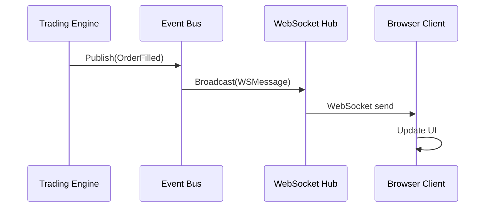

# Phase 15: Live Server Integration - Implementation Guide

## Executive Summary

This document provides a complete implementation guide for Phase 15: integrating the live_server's real-time monitoring and visualization capabilities into the market_maker trading engine.

## Objectives

1. **Enable Real-time Monitoring**: Operators can visually monitor strategy performance via web UI
2. **Maintain Isolation**: Live server operations MUST NOT affect trading engine performance
3. **Code Reuse**: Extract and reuse proven patterns from standalone live_server
4. **Backwards Compatibility**: Existing live_server binaries continue to work
5. **TDD Approach**: All features developed with tests-first methodology

## Feature Parity Analysis

### ✅ What live_server Has (and market_maker Needs)

| Feature | Impact | Priority |
|---------|--------|----------|
| WebSocket broadcasting | Enables web UI | **HIGH** |
| TradingView charts | Visual price monitoring | **HIGH** |
| Real-time order lines | Order visualization | **HIGH** |
| Trade notifications | Operator awareness | **MEDIUM** |
| Multi-client support | Team collaboration | **MEDIUM** |
| Account balance display | PnL tracking | **HIGH** |
| Position tracking | Risk awareness | **HIGH** |

### ✅ What market_maker Has (that live_server Lacks)

| Feature | Already Implemented |
|---------|---------------------|
| Grid trading logic | ✅ GridStrategy |
| Risk management | ✅ RiskMonitor, Cleaner, Reconciler |
| State persistence | ✅ SQLite/DBOS |
| Health monitoring | ✅ Phase 14 complete |
| Multi-exchange support | ✅ 5 exchanges |
| Durable workflows | ✅ DBOS engine |

### 🎯 Integration Goal

**Combine the best of both**: market_maker's robust trading engine + live_server's visualization capabilities.

## Architecture

### Component Overview

```
market_maker/
├── pkg/liveserver/           # New: Reusable live server components
│   ├── hub.go               # WebSocket hub pattern
│   ├── messages.go          # Message type definitions
│   ├── server.go            # HTTP + WebSocket server
│   └── authenticator.go     # Optional auth
├── internal/engine/
│   └── events.go            # New: Event publishing
├── cmd/market_maker/
│   └── main.go              # Wire live server (optional)
└── web/
    └── live.html            # Served at /live
```

### Data Flow



## Implementation Plan

### Phase 15A: Core Extraction (Week 1)

#### Task 15A.1: Extract Hub Pattern
**File**: `pkg/liveserver/hub.go`

**Interface**:
```go
type Hub interface {
    Run(ctx context.Context)
    Register(client *Client)
    Unregister(client *Client)
    Broadcast(msg WSMessage)
    ClientCount() int
}
```

**Tests**: `pkg/liveserver/hub_test.go`
- [ ] TestHubRegisterClient
- [ ] TestHubUnregisterClient
- [ ] TestHubBroadcast
- [ ] TestHubConcurrentClients
- [ ] TestHubSlowClientDisconnect

#### Task 15A.2: Define Message Types
**File**: `pkg/liveserver/messages.go`

```go
type WSMessage struct {
    Type string      `json:"type"`
    Data interface{} `json:"data"`
}

type KlineData struct {
    Time   int64  `json:"time"`
    Open   string `json:"open"`
    High   string `json:"high"`
    Low    string `json:"low"`
    Close  string `json:"close"`
    Volume string `json:"volume"`
}

type GridStateData struct {
    AnchorPrice    string     `json:"anchor_price"`
    PriceInterval  string     `json:"price_interval"`
    ActiveSlots    []SlotInfo `json:"active_slots"`
}

// ... more message types
```

**Tests**: `pkg/liveserver/messages_test.go`
- [ ] TestMessageSerialization
- [ ] TestPrecisionPreservation

#### Task 15A.3: HTTP/WebSocket Server
**File**: `pkg/liveserver/server.go`

```go
type Server struct {
    hub    Hub
    srv    *http.Server
    logger core.ILogger
    auth   Authenticator
}

func (s *Server) Start(addr string) error
func (s *Server) Stop(ctx context.Context) error
func (s *Server) HandleWebSocket(w http.ResponseWriter, r *http.Request)
func (s *Server) ServeFrontend(w http.ResponseWriter, r *http.Request)
```

**Tests**: `pkg/liveserver/server_test.go`
- [ ] TestServerStart
- [ ] TestWebSocketUpgrade
- [ ] TestMultipleClients
- [ ] TestClientDisconnect

### Phase 15B: Engine Integration (Week 2)

#### Task 15B.1: Event Publishing
**File**: `market_maker/internal/engine/events.go`

```go
type EventBus struct {
    subscribers map[EventType][]chan<- Event
    mu          sync.RWMutex
}

func (eb *EventBus) Publish(event Event)
func (eb *EventBus) Subscribe(eventType EventType) <-chan Event
```

**Integration Points**:
1. `PriceMonitor.handlePriceUpdate()` → Publish `PriceChanged`
2. `OrderExecutor.PlaceOrder()` → Publish `OrderPlaced`
3. `PositionManager.ApplyActionResults()` → Publish `GridStateChanged`
4. `RiskMonitor.handleCandle()` → Publish `RiskAlert`

#### Task 15B.2: Wire Live Server
**File**: `cmd/market_maker/main.go`

```go
// Add flag
livePort := flag.String("live-port", "", "Enable live server on port (e.g., :8081)")

// Initialize live server if enabled
if *livePort != "" {
    liveServer := liveserver.NewServer(logger)
    
    // Subscribe to events
    liveServer.SubscribePriceChanges(priceMonitor.SubscribePriceChanges())
    liveServer.SubscribeOrderEvents(orderExecutor.SubscribeOrderEvents())
    liveServer.SubscribeGridChanges(positionManager.SubscribeGridChanges())
    
    // Start server
    liveServer.Start(*livePort)
    defer liveServer.Stop(context.Background())
}
```

**Tests**: `tests/e2e/liveserver_test.go`
- [ ] TestLiveServerIntegration
- [ ] TestPriceUpdatesFlow
- [ ] TestOrderEventsFlow
- [ ] TestGridStateFlow

### Phase 15C: Advanced Features (Week 3)

#### Task 15C.1: Grid Visualization
**Enhancement**: Add grid state to WebSocket messages

```go
type GridVisualization struct {
    Slots []struct {
        SlotID string `json:"slot_id"`
        Price  string `json:"price"`
        Side   string `json:"side"`
        Status string `json:"status"` // EMPTY, OPEN, FILLED
    } `json:"slots"`
    AnchorPrice string `json:"anchor_price"`
}
```

**Frontend**: Add visual grid levels to TradingView chart

#### Task 15C.2: Risk Alerts
**Enhancement**: Broadcast risk monitor events

```go
type RiskAlertData struct {
    Severity string `json:"severity"` // LOW, MEDIUM, HIGH, CRITICAL
    Symbol   string `json:"symbol"`
    Reason   string `json:"reason"`
    Details  map[string]interface{} `json:"details"`
}
```

**Frontend**: Show alert banner on critical events

#### Task 15C.3: Historical Replay
**Enhancement**: Serve historical candles from SQLite

```go
func (s *Server) GetHistoricalCandles(symbol string, limit int) ([]KlineData, error) {
    // Query from SQLite store
    return store.GetCandles(symbol, limit)
}
```

### Phase 15D: Production Hardening (Week 4)

#### Task 15D.1: Authentication
**File**: `pkg/liveserver/authenticator.go`

```go
type Authenticator interface {
    Validate(token string) (bool, error)
}

type JWTAuthenticator struct {
    secret []byte
}

type APIKeyAuthenticator struct {
    validKeys map[string]bool
}
```

#### Task 15D.2: Load Testing
**Tool**: `k6` or `go test -bench`

**Scenarios**:
- 100 concurrent clients
- 1000 messages/second broadcast rate
- Measure latency and memory usage

**Acceptance Criteria**:
- Broadcast latency < 50ms (p99)
- Memory per client < 1MB
- CPU overhead < 5%

#### Task 15D.3: Documentation
- [ ] API documentation (message types)
- [ ] Deployment guide (Docker, K8s)
- [ ] Operator manual (how to use web UI)
- [ ] Troubleshooting guide

## Testing Strategy

### Unit Tests
```go
// pkg/liveserver/hub_test.go
func TestHubBroadcastToMultipleClients(t *testing.T) {
    hub := NewHub()
    
    client1 := NewMockClient()
    client2 := NewMockClient()
    
    hub.Register(client1)
    hub.Register(client2)
    
    msg := WSMessage{Type: "kline", Data: mockKlineData}
    hub.Broadcast(msg)
    
    assert.Equal(t, msg, client1.ReceivedMessages[0])
    assert.Equal(t, msg, client2.ReceivedMessages[0])
}
```

### Integration Tests
```go
// tests/integration/liveserver_integration_test.go
func TestLiveServerReceivesEngineEvents(t *testing.T) {
    // Start mock engine
    engine := mock.NewEngine()
    
    // Start live server
    server := liveserver.NewServer(logger)
    server.SubscribePriceChanges(engine.PriceChan())
    
    // Trigger price change
    engine.EmitPriceChange(decimal.NewFromInt(42000))
    
    // Verify WebSocket message
    client := ConnectTestClient(server.Address())
    msg := client.WaitForMessage()
    
    assert.Equal(t, "kline", msg.Type)
}
```

### E2E Tests
```go
// tests/e2e/liveserver_e2e_test.go
func TestE2E_TradingFlowWithLiveServer(t *testing.T) {
    // Start full stack
    exchange := mock.NewMockExchange()
    engine := NewTestEngine(exchange)
    liveServer := NewTestLiveServer(engine)
    
    // Connect WebSocket client
    wsClient := ConnectWebSocket(liveServer.URL())
    
    // Trigger trade
    exchange.InjectPriceChange(42000)
    engine.WaitForOrderPlacement()
    
    // Verify client received messages
    messages := wsClient.CollectMessages(3 * time.Second)
    
    assert.Contains(t, messages, MessageType("kline"))
    assert.Contains(t, messages, MessageType("orders"))
    assert.Contains(t, messages, MessageType("grid_state"))
}
```

## Deployment Options

### Option 1: Embedded (Recommended)
```bash
./market_maker --config config.yaml --live-port :8081
```

**Pros**: Single binary, shared state, lower resource usage
**Cons**: Frontend issues could affect engine (mitigated)

### Option 2: Standalone
```bash
./live_server_binance --config config.yaml --port :8081
```

**Pros**: Complete isolation
**Cons**: Duplicate connections, higher resources

### Option 3: Docker Compose
```yaml
services:
  market-maker:
    image: opensqt/market-maker:latest
    command: ["--config", "/config/config.yaml", "--live-port", ":8081"]
    ports:
      - "8080:8080"  # Health/metrics
      - "8081:8081"  # Live WebSocket
    volumes:
      - ./config.yaml:/config/config.yaml
      - ./data:/app/data
```

## Success Criteria

### Phase 15A Complete
- [ ] Hub pattern extracted and tested
- [ ] Message types defined and serialization verified
- [ ] HTTP/WebSocket server runs independently
- [ ] 100% test coverage on core components

### Phase 15B Complete
- [ ] market_maker binary serves `/live` endpoint when flag enabled
- [ ] Real-time K-lines visible in TradingView chart
- [ ] Order events trigger visual updates
- [ ] Grid state displayed with buy/sell levels
- [ ] E2E test validates end-to-end flow

### Phase 15C Complete
- [ ] Grid visualization matches strategy logic
- [ ] Risk alerts display in real-time
- [ ] Historical replay works from SQLite
- [ ] Multi-symbol switching implemented

### Phase 15D Complete
- [ ] Authentication prevents unauthorized access
- [ ] Load tests pass (100 clients, <50ms latency)
- [ ] Documentation complete
- [ ] Production deployment verified

## Risks & Mitigations

| Risk | Probability | Impact | Mitigation |
|------|-------------|--------|------------|
| WebSocket broadcast adds latency | Medium | High | Non-blocking sends, buffered channels, separate goroutines |
| Memory leak from abandoned clients | Medium | Medium | Connection timeout, health checks, auto-disconnect |
| Frontend bugs affect engine | Low | High | Complete process isolation via separate port |
| Authentication complexity | Medium | Low | Optional feature, implement later if needed |
| Performance degradation | Low | High | Comprehensive benchmarking, load testing before merge |

## Timeline

### Week 1: Extraction & Foundation
- Mon-Tue: Extract Hub, Messages
- Wed-Thu: HTTP/WebSocket Server
- Fri: Unit tests and documentation

### Week 2: Integration
- Mon-Tue: Event publishing in engine
- Wed-Thu: Wire live server to main.go
- Fri: Integration tests

### Week 3: Features
- Mon: Grid visualization
- Tue: Risk alerts
- Wed-Thu: Historical replay
- Fri: Frontend enhancements

### Week 4: Production
- Mon-Tue: Authentication
- Wed: Load testing
- Thu: Documentation
- Fri: Production deployment

## Conclusion

Phase 15 brings critical **monitoring and visualization** capabilities to the market_maker by integrating proven patterns from the standalone live_server. The hybrid approach allows:

✅ Visual real-time monitoring for operators
✅ Professional charting via TradingView
✅ No impact on trading engine performance
✅ Gradual migration path with backwards compatibility
✅ Comprehensive test coverage via TDD

The implementation follows established patterns from Phase 1-14, maintains code quality standards, and provides immediate value to operators.
