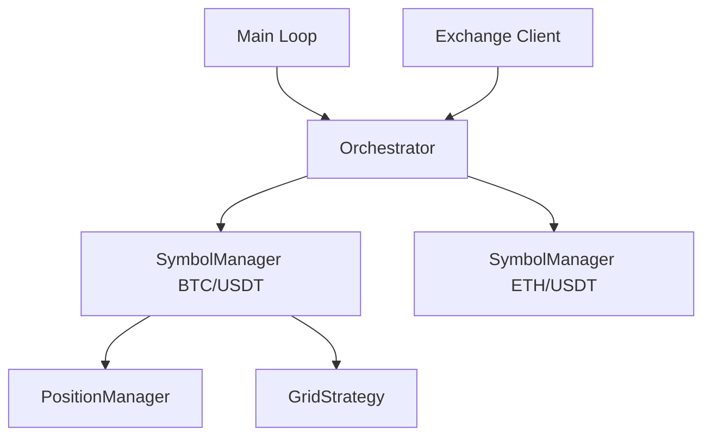

# Phase 18.2: Multi-Symbol Orchestration

**Project**: OpenSQT Market Maker  
**Phase**: 18.2 - Multi-Symbol Orchestration  
**Status**: Active  
**Approach**: Specs-Driven Development + Test-Driven Development (TDD)

---

## 1. Requirement Specification

### 1.1 Overview
The system currently supports a single symbol per `market_maker` process. This is inefficient for trading many pairs. Multi-symbol orchestration allows a single binary to manage multiple grid strategies and position managers concurrently.

### 1.2 Functional Requirements

#### REQ-ORCH-001: Orchestrator Component
- The system MUST include an `Orchestrator` that manages a collection of `SymbolManager` instances.
- Each `SymbolManager` encapsulates the logic for one trading pair (PositionManager, Strategy, RiskMonitor).

#### REQ-ORCH-002: Resource Sharing
- All `SymbolManager` instances MUST share a single `IExchange` (usually `RemoteExchange` gRPC client) to minimize overhead and respect API rate limits.
- The `Orchestrator` MUST multiplex incoming exchange events (price changes, order updates) to the correct `SymbolManager`.

#### REQ-ORCH-003: Dynamic Configuration
- The system SHOULD support adding or removing symbols without a full restart (initial version can use static config list).

#### REQ-ORCH-004: Aggregate Risk Control
- The `Orchestrator` MUST provide a way to monitor and limit aggregate exposure across all symbols.

### 1.3 Architecture


---

## 2. Technical Design

### 2.1 Component Structure
A new `Orchestrator` struct in `internal/trading/orchestrator`.

```go
type Orchestrator struct {
    exchange core.IExchange
    managers map[string]*SymbolManager
    logger   core.ILogger
    // ...
}

type SymbolManager struct {
    symbol string
    engine engine.Engine
    // ...
}
```

### 2.2 Workflow
1. `Orchestrator` starts and initializes N `SymbolManager` instances based on config.
2. `Orchestrator` starts a single `OrderStream` and `PriceStream` (or multiple if exchange requires per-symbol price streams).
3. On event:
    - Price Update: Route to `SymbolManager` for that symbol.
    - Order Update: Route to `SymbolManager` based on symbol in execution report.

---

## 3. Test Plan (TDD)

### 3.1 Unit Tests
- `TestOrchestrator_Routing`: Verify events reach the correct manager.
- `TestOrchestrator_Lifecycle`: Verify all managers start/stop correctly.

### 3.2 Integration Tests
- `TestMultiSymbol_Trading`: Verify simultaneous trading on two symbols using `SimulatedExchange`.

---

## 4. Implementation Steps
1. Define `SymbolManager` to encapsulate symbol-specific components.
2. Implement `Orchestrator` to manage multiple `SymbolManager` instances.
3. Update `main.go` to use `Orchestrator` instead of single instances.
4. Verify with TDD.
