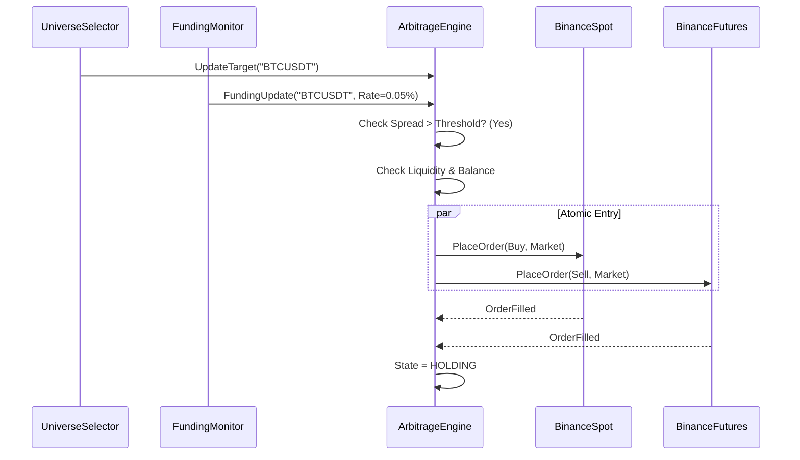

# Specification 026: Funding Rate Arbitrage Strategy

## 1. Overview
The Funding Rate Arbitrage strategy aims to capture the **Funding Fee** spread between two exchanges for the same asset (e.g., BTCUSDT). By taking a **Long** position on an exchange with low/negative funding and a **Short** position on an exchange with high positive funding, the system earns the difference in funding rates while maintaining a **Delta Neutral** exposure to price movements.

## 2. Terminology
- **Leg A (Long Leg)**: The position where we buy the asset (e.g., Spot Buy or Perp Long).
- **Leg B (Short Leg)**: The position where we sell the asset (e.g., Perp Short).
- **Spread**:
    - *Cross-Exchange*: `FundingRate(Short Leg) - FundingRate(Long Leg)`.
    - *Same-Exchange*: `FundingRate(Short Leg)` (since Spot has 0 funding).
- **Net APR**: The annualized return after accounting for transaction fees and funding income.

## 3. Functional Requirements

### 3.1 Multi-Exchange & Multi-Product Connectivity
- The system **MUST** support connecting to multiple exchanges simultaneously.
- The system **MUST** support connecting to different product types (Spot, Futures/Swap) on the same exchange simultaneously (e.g., `BinanceSpot` and `BinanceFutures`).
- Each connection must maintain isolated rate limiters and authentication contexts.

### 3.2 Funding Rate Monitoring
- **Real-time Ingestion**: The system must subscribe to real-time funding rate updates for target symbols on all active exchanges.
- **Prediction**: Where possible, the system should ingest "Predicted Funding Rate" to anticipate trends.
- **History**: The system should track the last `N` funding intervals to calculate average yield.

### 3.3 Universe Selection
- **Role**: Automated discovery of high-yield opportunities.
- **Capabilities**:
    - Scan entire universe of available Perp contracts (e.g., all USDT-M Futures on Binance).
    - Filter by 24h Volume (Liquidity Check).
    - Filter by Funding Rate threshold (e.g., > 0.01% per interval).
    - Rank by predicted APR.
- **Frequency**: Periodic (e.g., every 15 minutes) or Event-Driven.

### 3.4 Opportunity Detection
- **Trigger Condition (Spot-Perp)**:
  ```
  FundingRate_Short * 3 * 365 > Min_Target_APR + (Spot_Fees + Perp_Fees + Slippage)
  ```
- **Entry Logic**:
  - Verify sufficient margin on both exchanges/accounts.
  - Verify `OrderBook` liquidity is sufficient for the target size (limit slippage).
  - Execute atomic (or near-atomic) orders: Buy Spot, Sell Perp.
  - **Collateral**: Ensure Short leg has sufficient collateral (usually USDT).

### 3.5 Position Management (Delta Neutral)
- **Neutrality Check**: `Abs(Size_Long - Size_Short) < Threshold`.
- **Rebalancing**: If price moves significantly, one leg will gain PnL (increasing margin) while the other loses (decreasing margin). The system **MUST** support rebalancing collateral (manual or automated transfer alerts) to prevent liquidation on the losing leg.

### 3.6 Exit Logic
- **Convergence**: Spread narrows below a threshold or becomes negative.
- **Funding Reversal**: The funding rate polarity flips (Short leg becomes negative).
- **Emergency**: Liquidation risk detected on either leg.

## 4. Architecture Changes

### 4.1 New Component: FundingMonitor
- **Role**: Parallels `PriceMonitor`.
- **Responsibility**: Maintain the latest funding rates for all subscribed exchanges.
- **Interface**:
  ```go
  type IFundingMonitor interface {
      GetRate(exchange, symbol string) (decimal.Decimal, error)
      GetNextFundingTime(exchange, symbol string) (time.Time, error)
      Subscribe(exchange, symbol string) <-chan *pb.FundingUpdate
  }
  ```

### 4.2 New Component: UniverseSelector
- **Role**: Scans market data to find top candidates.
- **Input**: List of all symbols, Funding Rates, 24h Ticker Stats (Volume), Historical Funding Rates.
- **Output**: `TargetSymbol` (e.g., "BTCUSDT" or "ETHUSDT").
- **Logic**: 
    1. Fetch 24h Tickers for all exchanges in the strategy.
    2. Identify "Liquid Universe": Symbols with `QuoteVolume > MinLiquidity` on ALL required exchanges.
    3. Fetch Current and Historical Funding Rates (last 30 days) for the Liquid Universe.
    4. **Analyze Quality**:
        - **SMA (1d, 3d, 7d, 30d)**: Multi-cycle averages to identify consistent yield.
        - **Stability Score**: `Mean / Standard Deviation` of funding rates. Higher is better.
        - **Positive Ratio**: % of intervals where funding was positive (for Short strategies).
        - **Momentum (Slope)**: Linear regression slope of the last 10 intervals. Positive momentum is preferred.
        - **Regime Age**: Number of intervals since the last sign flip.
        - **Basis Premium**: `(PerpPrice - SpotPrice) / SpotPrice`.
        - **OI Factor**: `OpenInterest / 24hQuoteVolume`.
        - **Volatility Filter**: Exclude symbols with 30-day Price StdDev > Config limit.
    5. **Rank by Quality Score (v3 - Optimized)**:
        `Score = (YieldComponent) * StabilityComponent * MomentumComponent * MarketMaturityComponent`
        - Use `float64` for ranking math to ensure performance during bulk scans.
        - `YieldComponent` = weighted average of SMAs (1d, 7d, 30d).
        - `MomentumComponent` = 1.0 + Clamp(slope * 1000, -0.5, 0.5).
        - `MarketMaturityComponent` = (1.0 + math.Log10(RegimeAge)) * (1.0 + OIFactor).
    6. **Parallel Discovery**: Use a worker pool (N=20) for historical data fetching to maintain <5s scan time for 200+ symbols.
- **Frequency**: Periodic (e.g., every 1 hour or 15 mins).

### 4.3 New Component: ArbitrageEngine
- **Role**: Coordinates the multi-leg strategy.
- **Difference from PositionManager**:
  - `PositionManager` manages ONE symbol on ONE exchange using a GRID.
  - `ArbitrageEngine` manages ONE symbol pair across TWO exchanges using POSITIONS.
- **State**:
  - `LongLeg`: {Exchange, Symbol, Size, EntryPrice}
  - `ShortLeg`: {Exchange, Symbol, Size, EntryPrice}
  - `Status`: `SEARCHING` | `ENTERING` | `HOLDING` | `EXITING`

### 4.4 New Component: UniverseManager
- **Role**: High-level orchestrator of the scanning lifecycle.
- **Responsibility**: 
    - Executes `UniverseSelector.Scan()` every $N$ minutes.
    - Maintains a local cache of the latest "High Quality" opportunities.
    - Decides when to switch the `ArbitrageEngine` to a new target.
    - **Switching Rule**: Switch only if `(New_Quality_Score / Current_Quality_Score) > 1.2` (Hysteresis) AND estimated profit gain covers double trading fees (Maker/Taker fees on both legs).
- **Interface**:
    ```go
    type IUniverseManager interface {
        Start(ctx context.Context) error
        GetTopOpportunities() []Opportunity
        GetActiveTarget() string
        SetArbitrageEngine(engine IArbitrageEngine)
    }
    ```

### 5.1 Spot-Perp Execution Workflow


### 5.2 Atomic Entry (DBOS Durable Workflow)
To ensure atomicity in distributed execution, the DBOS engine implements the following workflow (`ExecuteSpotPerpEntry`):
1.  **Step 1: Buy Spot**: Execute market buy on Spot exchange.
    *   *Failure*: Abort workflow (nothing to unwind).
    *   *Success*: Proceed to Step 2.
2.  **Step 2: Sell Perp**: Execute market sell on Perp exchange.
    *   *Success*: Workflow Complete (State = HOLDING).
    *   *Failure*: Trigger **Compensation Logic**.
3.  **Step 3: Compensation (Unwind Spot)**:
    *   Execute market sell on Spot exchange to close the leg opened in Step 1.
    *   *Constraint*: Must sell `ExecutedQty` from Step 1 (or original quantity if fill details unavailable).
    *   *Outcome*: Workflow fails, but state is neutral (minus fees).

### 5.3 Liquidation Guard Workflow
To protect capital during high volatility, the system monitors the Distance to Liquidation on the Perp leg:
1.  **Metric**: `Distance = Abs(LiquidationPrice - MarkPrice) / MarkPrice`.
2.  **Trigger**: If `Distance < LiquidationThreshold` (e.g., 10%), execute `ExecuteSpotPerpExit`.
3.  **Priority**: Emergency exit bypasses spread convergence checks.

## 6. Configuration Parameters
- `strategy_type`: Set to `arbitrage`.
- `arbitrage_spot_exchange`: The exchange name for Spot leg (e.g., `binance_spot`).
- `arbitrage_perp_exchange`: The exchange name for Perp leg (e.g., `binance`).
- `min_spread_apr`: Annualized yield threshold to enter (e.g., `0.10` for 10%).
- `exit_spread_apr`: Annualized yield threshold to exit (e.g., `0.01` for 1%).
- `liquidation_threshold`: Distance to liquidation to trigger emergency exit (e.g., `0.10` for 10%).

## 7. Data Models (Proto)

```protobuf
message ArbitrageEntryRequest {
    string spot_exchange = 1;
    string perp_exchange = 2;
    PlaceOrderRequest spot_order = 3;
    PlaceOrderRequest perp_order = 4;
}

message ArbitrageExitRequest {
    string spot_exchange = 1;
    string perp_exchange = 2;
    PlaceOrderRequest spot_order = 3;
    PlaceOrderRequest perp_order = 4;
}

message FundingRate {
    string exchange = 1;
    string symbol = 2;
    google.type.Decimal rate = 3;           // e.g., 0.0001 (0.01%)
    google.type.Decimal predicted_rate = 4;
    int64 next_funding_time = 5;
    int64 timestamp = 6;
}

message Ticker {
    string symbol = 1;
    google.type.Decimal price_change = 2;
    google.type.Decimal price_change_percent = 3;
    google.type.Decimal last_price = 4;
    google.type.Decimal volume = 5;       // Base Volume
    google.type.Decimal quote_volume = 6; // Quote Volume (Liquidity Proxy)
    int64 timestamp = 7;
}
```

## 8. Risk Controls
- **Liquidation Guard**: If `MarkPrice` approaches `LiquidationPrice` within `X%`, trigger immediate exit (or rebalance alert).
- **Execution Slip**: If one leg fills but the other fails/times out, the system must either:
  - Retry the failed leg aggressively (market).
  - Immediately close the filled leg (abort).
- **Fee Guard**: Do not trade if `Spread < 2 * TakerFee`.

## 9. Metrics
- **Spread History**: Time-series of funding spreads.
- **Realized PnL**: Separated into "Price PnL" (should be ~0) and "Funding PnL" (Profit).
