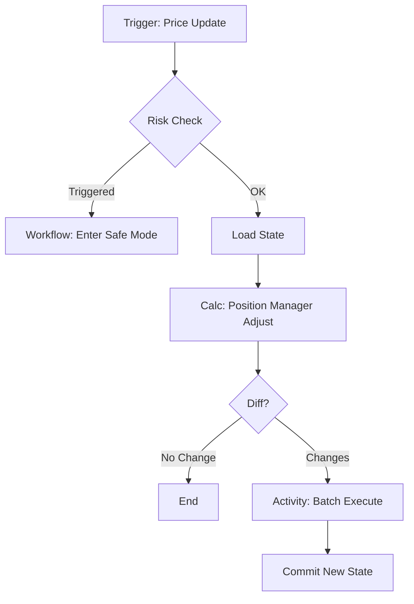

# Durable Orchestrator & Workflow Specification

## 1. Objective
Replace the ephemeral in-memory trading loop with a durable, resilient workflow engine. This ensures the market maker can survive process restarts and crashes without losing critical state (active slots, risk status).

## 2. Architecture
The system moves from a procedural `main` loop to a **State-Machine-based Workflow**.

### Core Components
1. **Workflow Engine**: Manages the execution of trading steps.
2. **State Store**: Persists the `WorldState` (SlotMap, RiskFlags).
3. **Activities**: Idempotent side-effects (PlaceOrder, CancelOrder).

## 3. Workflow Definition: `TradingStep`

### Trigger
- **Event**: `PriceChange` (via PriceMonitor) OR `Tick` (Time-based).

### Execution Flow


## 4. Implementation Choice: Durable Workflow Engine (DBOS)
We use **DBOS-transact** to provide durable, transactional execution of trading workflows. This replaces the simple in-memory or SQLite-blob persistence with a robust, multi-step transaction framework.

### Why DBOS?
- **Durable Execution**: Steps are automatically resumed from the last successful point after a crash.
- **Transactional Integrity**: Trading state and order execution activities are atomic.
- **Observability**: Built-in monitoring of workflow status and step timing.
- **Resilience**: Handles retries and failure recovery natively.

## 5. Interfaces

### Engine Interface
```go
type Engine interface {
	Start(ctx context.Context) error
	Stop() error
	OnPriceUpdate(ctx context.Context, price pb.PriceChange) error
}
```

### State Store Interface
```go
type Store interface {
	SaveState(ctx context.Context, state *pb.State) error
	LoadState(ctx context.Context) (*pb.State, error)
}
```

### State Structure
```go
// Defined in api/proto/v1/models.proto
message State {
	map<string, InventorySlot> slots = 1; // Key is decimal string
	string last_price = 2;
	int64 last_update_time = 3;
}
```

## 7. Persistence (SQLite Implementation)

### Schema
We use a single-row table to store the JSON blob of the state.

```sql
CREATE TABLE IF NOT EXISTS state (
    id INTEGER PRIMARY KEY CHECK (id = 1),
    data TEXT NOT NULL, -- JSON serialization of State
    updated_at INTEGER NOT NULL
);
```

### Strategy
- **Save**: `INSERT OR REPLACE INTO state (id, data, updated_at) VALUES (1, ?, ?)`
- **Load**: `SELECT data FROM state WHERE id = 1`
- **Interval**: State is saved on every price update that results in a potential order adjustment.
